# VST Week 4 – Day 1  
### **Ngspice Sky130 Basics: NMOS Drain Current (ID) vs Drain-to-Source Voltage (VDS)**

---

## Objective
To understand the **NMOS transistor characteristics** using **Ngspice** with **Sky130 PDK**, focusing on how **drain current (ID)** varies with **drain-to-source voltage (VDS)** and the importance of **SPICE modeling** in CMOS circuit design.

---

## Introduction to SPICE Engine

- The day began with an introduction to **Ngspice**, a SPICE-based circuit simulation engine used to analyze electronic circuits at the transistor level.  
- Our mentor **Kunal Ghosh Sir** started by sparking curiosity with three fundamental questions:

1. Where does the **delay of a cell** actually come from?  
2. The **delay tables** we use — where do they originate?  
3. How can we **verify** if the delay models and timing data in STA (like in Synthesis or GDS flows) are accurate?

These questions form the foundation for understanding why **SPICE simulations** are essential — they help derive accurate transistor-level characteristics that later feed into timing models and delay tables.

---

## Structural Description of NMOS

We discussed the **physical structure** and **electrical behavior** of an NMOS transistor:

- NMOS is a **four-terminal device**:
  - **Gate (G)**
  - **Drain (D)**
  - **Source (S)**
  - **Body/Substrate (B)**
- It consists of:
  - P-type substrate  
  - N+ diffusion regions (Source & Drain)  
  - Gate oxide  
  - Polysilicon gate  
  - Isolation regions separating adjacent transistors  

- The **body (substrate)** is usually grounded and affects the **threshold voltage (Vt)**.

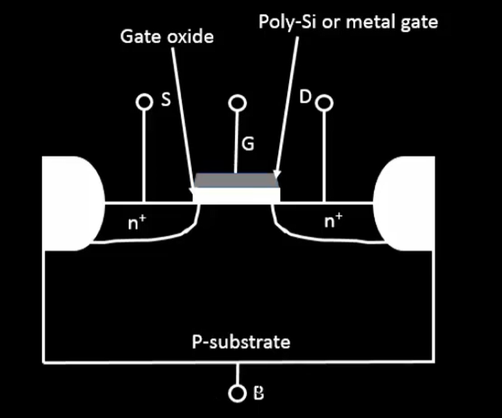

---

## Threshold Voltage (Vt)

- When **VGS = 0**, both the **source-substrate** and **drain-substrate** junctions form **PN diodes**, making the channel highly resistive.
- As **VGS** increases, **positive gate voltage** attracts **negative charge carriers (electrons)** to the surface, forming an **inversion layer**.  
- The voltage at which this inversion becomes strong enough for current to flow is called the **Threshold Voltage (Vt)**.

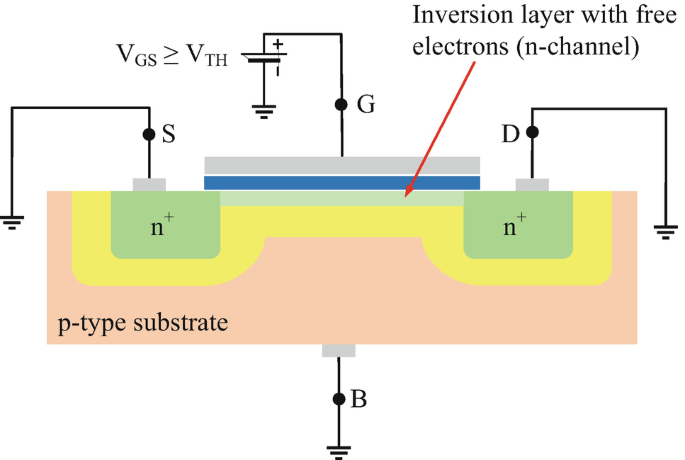
---

## Substrate Bias (Body Effect)

We analyzed two conditions for **VSB (source-to-bulk (substrate) bias):**

1. **VSB = 0** → Normal threshold voltage (no body effect)  
2. **VSB > 0** → Increases depletion width → Increases threshold voltage  

Hence, **additional potential** is required to achieve strong inversion in the presence of substrate bias.


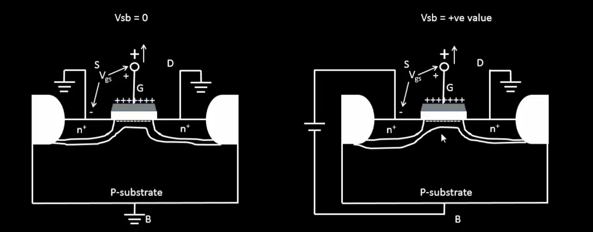


### Threshold Voltage Equation:

\[
V_T = V_{T0} + \gamma \left(\sqrt{|\phi_f + V_{SB}|} - \sqrt{|\phi_f|}\right)
\]

Where:  
- \( V_{T0} \): Zero-bias threshold voltage  
- \( \gamma = \sqrt{\frac{2qN_A \varepsilon_{Si}}{C_{ox}}} \): Body effect coefficient  
- \( \phi_f = -\phi_t \ln\left(\frac{N_A}{N_i}\right) \): Fermi potential  

---

## Modes of Operation

### **Cutoff Region**
- \( V_{GS} < V_T \)  
- No inversion channel formed → transistor OFF  

### **Resistive (Linear/Triode) Region**
- \( V_{GS} > V_T \) and \( V_{DS} < (V_{GS} - V_T) \)  
- Channel exists → behaves like a resistor  
- Current is **linearly** proportional to \( V_{DS} \)

Current Equation (First-order analysis):

\[
I_D = K' \frac{W}{L} \left[(V_{GS} - V_T)V_{DS} - \frac{V_{DS}^2}{2}\right]
\]

###  **Saturation Region**
- \( V_{DS} \ge (V_{GS} - V_T) \)  
- Channel pinches off near the drain → current becomes constant  

Saturation current:

\[
I_{D,sat} = \frac{1}{2} K' \frac{W}{L} (V_{GS} - V_T)^2 (1 + \lambda V_{DS})
\]

Where:  
- \( K' = \mu_n C_{ox} \) (process transconductance parameter)  
- \( \lambda \): Channel-length modulation factor  

 **Pinch-off Condition:** 
\[
V_{GS} - V_{DS} \le V_T
\]

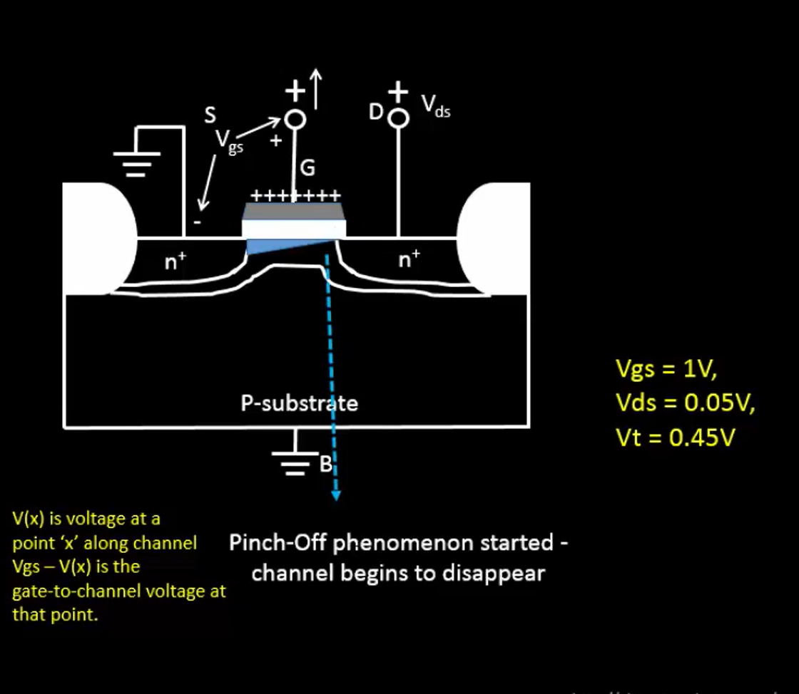

- The phenomenon where the channel gets disappeared in the drain side is called `Pinch Off` phenomenon.
---

## Device Current Mechanisms

There are **two fundamental current mechanisms** in MOSFETs:

| Type of Current | Cause | Description |
|-----------------|--------|-------------|
| **Drift Current** | Potential difference | Movement due to applied electric field |
| **Diffusion Current** | Concentration gradient | Flow from high to low carrier concentration |

Total Drain Current \( I_D \) is derived from the product of **carrier velocity** and **charge density** across the channel.

> **A detailed first-order derivation of I_d (Drain Current) is attached as a screenshot.**

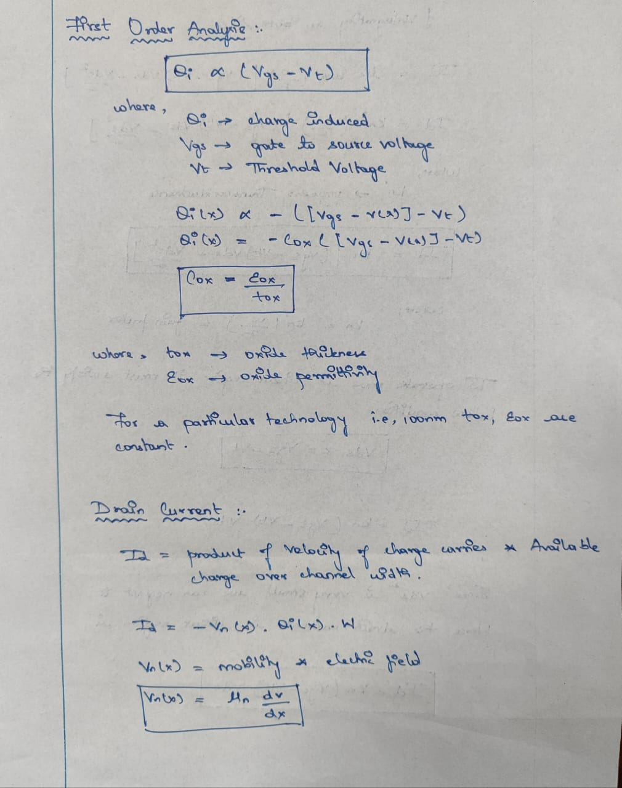
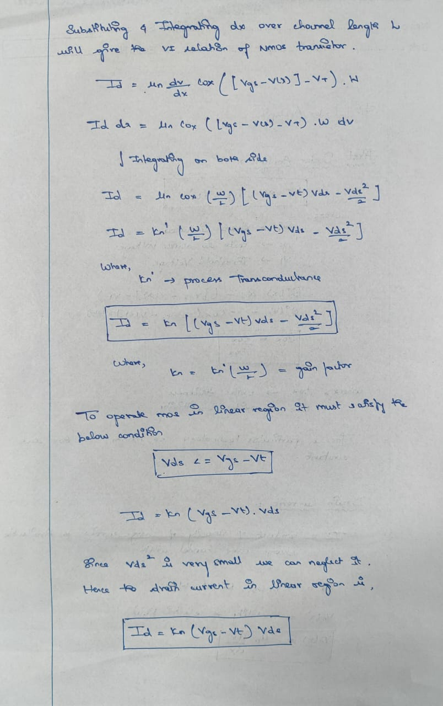


---

## SPICE Simulation Insight

We discussed how **SPICE simulations** are used to compute **ID vs VDS** characteristics by sweeping voltages for different **VGS** levels:

- For each **VGS**, **VDS** is swept from 0 to \( V_{GS} - V_T \)
- Simulation plots **ID vs VDS** curve  
- As **VDS** exceeds \( V_{GS} - V_T \), the device enters saturation

👉 This analysis answers the earlier question:  
**“How do we calculate ID for different VGS values?” → Using SPICE simulations.**

---

## SPICE Model Parameters

SPICE model parameters define the transistor behavior for a given technology (e.g., Sky130).  
Typical parameters include:

| Parameter | Meaning |
|------------|----------| 
| VTO | Threshold voltage |
| γ (gamma) | Body effect coefficient |
| Kn' | Transconductance parameter |
| λ | Channel-length modulation parameter |

Each **technology node (e.g., 130nm, 100nm)** has its unique set of constants.

---

## SPICE Netlist Structure

To simulate NMOS in **Ngspice**, we must write a **netlist** containing:

1. **Node Definition:** Define all circuit nodes (e.g., drain, gate, source, bulk).  
2. **Technology File:** Include the **Sky130 model file** (.lib / .model).  
3. **Simulation Commands:** Specify voltage sources and `.dc` or `.tran` commands for sweeping.

**Example (illustrative):**

```spice
M1 Vdd n1 0 0 nmos L=1.8u W=1.2u
R1 in n1 55
Vdd vdd 0 2.5
Vin in 0 2.5
.dc Vds 0 1.8 0.05
.plot dc I(M1)
.end

#Technology File
.Model nmos NMOS (Tox= ... + U0 = .... + GAMMA1= ...)
```
---

## Day-1 Lab:
### MOSFET Behavior & Id vs. Vds Characteristics

#### Installation of NGSpice
```command
sudo apt install ngspice
```
**Screenshot of the terminal**
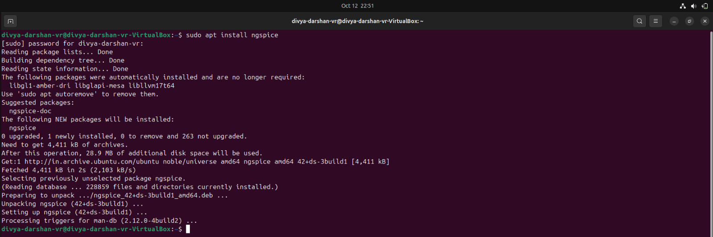

---
#### Exploration of Sky130designandworkshop Repo

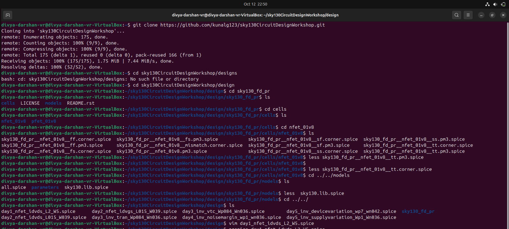

---
#### Cells of Sky130 circuit design and workshop repo:

```bash
1. nfet_01V8
2. pfet_01V8
```
- Here the nfet_01V8 contains library files
- Some of the files are 

```bash
1. sky130_fd_pr__nfet_01v8__tt.pm3.spice
2. sky130_fd_pr__nfet_01v8__tt.corner.spice
```
- Where `sky130_fd_pr__nfet_01v8__tt.pm3.spice` this lib contains the constant values like (lambda,gamma etc..)

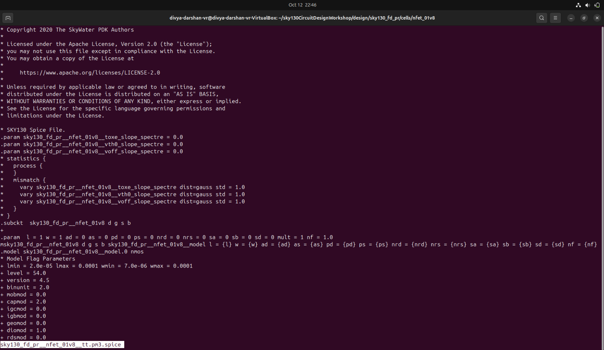

---

- Where `sky130_fd_pr__nfet_01v8__tt.corner.spice` contains the different parameters of (W/L) ratio.

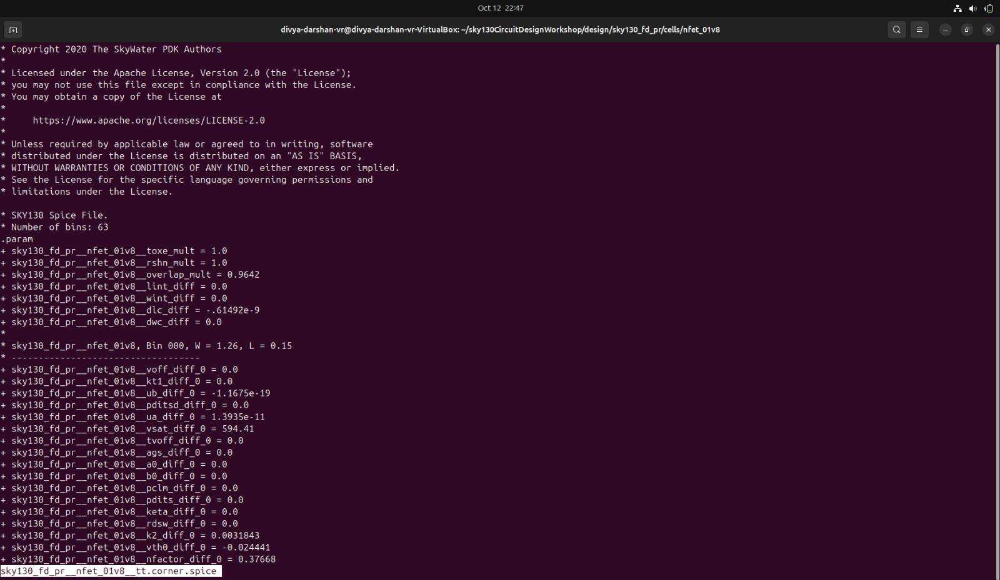

---
## Id vs Vds Characteristics

### Spice netlist file


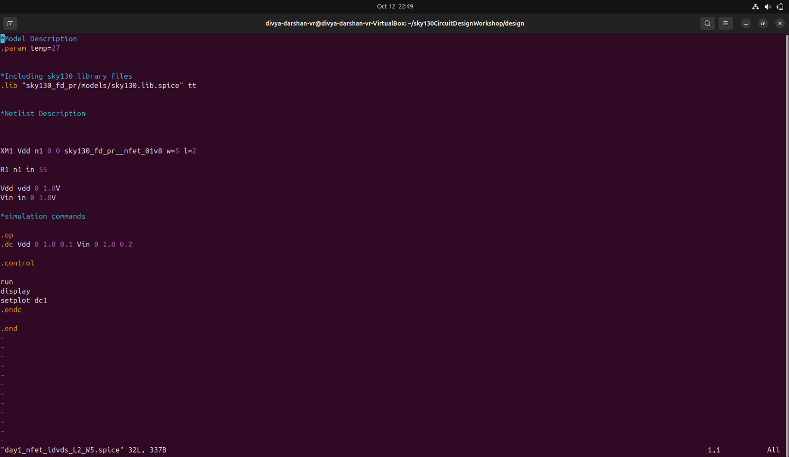

- The file is similar to the one what we discussed in the theory sessions. hence it is proved.
---
### NgSpice Simulation

- Command to run ngspice
```command
ngspice <netlist_file_name.spice>
```
- In our case I ran the command
```command
ngspice day1_nfet_idvds_L2_W5.spice
```
**Output of the terminal**

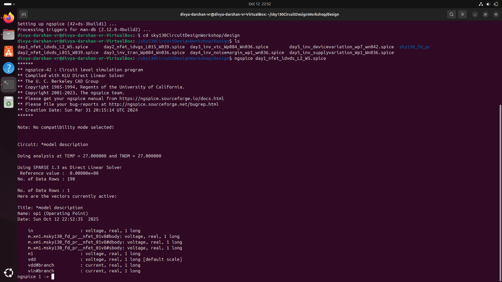

---

### DC Characteristics Graph

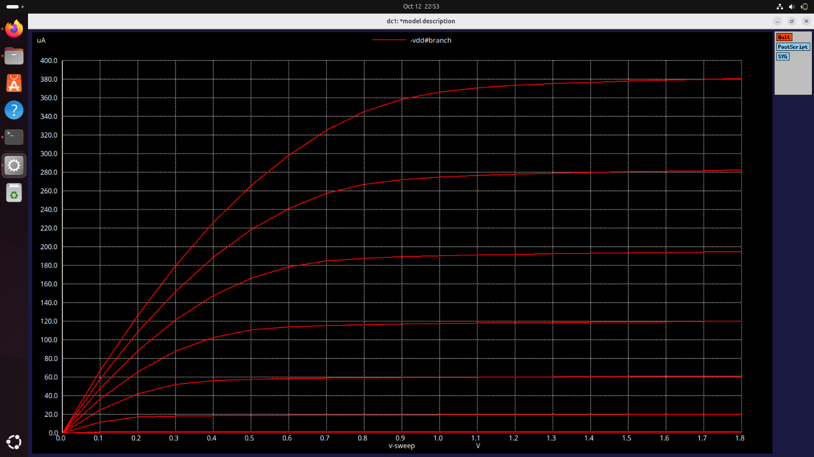

---