# Day 2: Velocity Saturation and Basics of CMOS Inverter VTC
---

## Objective
The goal for **Day 2** was to understand the **MOSFET behavior** in both long-channel and short-channel devices and explore the **basics of CMOS inverter operation**, including the derivation of its **Voltage Transfer Characteristic (VTC)**.  

**Key focuses:**
1. MOSFET I–V characteristics for long and short channel devices.  
2. Introduction to **velocity saturation** effects in short-channel MOSFETs.  
3. Static CMOS inverter behavior and VTC derivation.  

---

## 1. MOSFET I–V Characteristics

### 1.1 ID vs VGS Curves

We studied the **drain current (ID) vs gate-to-source voltage (VGS)** for both **long-channel** and **short-channel** MOSFETs. 

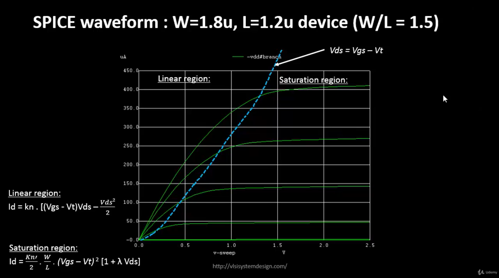

- As Vds is lower there is a quadraric dependence and but when `Vds` becomes greater than `Vgs-Vt` is becomes saturated.

- **Long-channel MOSFET:**
  - Exhibits **quadratic dependence** on VGS above threshold.  
  - I_D = kn (V_{GS} - V_T)^2  in the saturation region.  
  - Velocity saturation is negligible due to lower electric fields.  

- **Short-channel MOSFET:**
  - Initially follows **quadratic dependence**, then transitions to **linear behavior** at higher VGS.  
  - Velocity saturation occurs because carriers reach a **maximum velocity** under high electric fields.  

**Observation:** The short-channel device shows **current saturation earlier** due to velocity-limited carrier transport.  

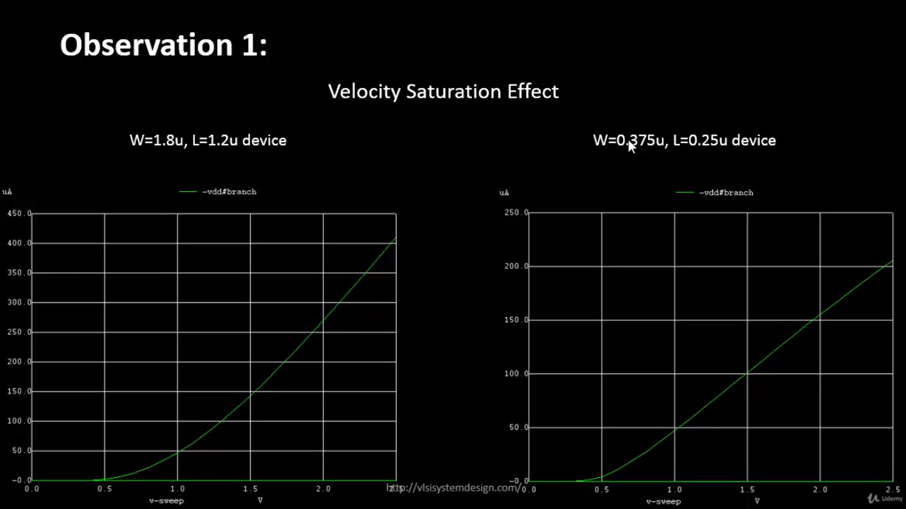

---

### 1.2 Definition of Velocity Saturation

- **Velocity saturation:** A phenomenon where carrier velocity **saturates** at high electric fields. 
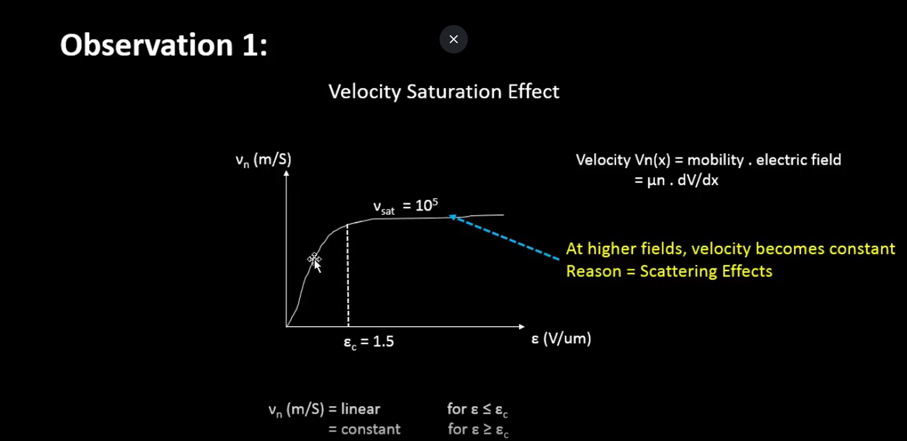

---

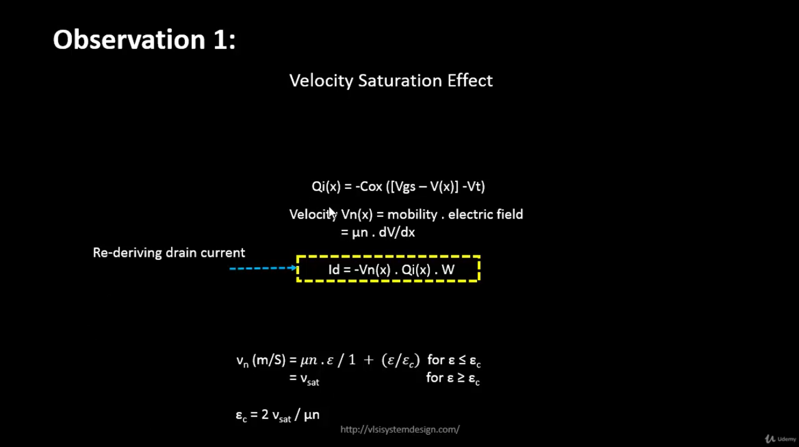


- At low electric fields: linear increase  
- At high electric fields: v to v_sat (velocity saturates)  

This effect is prominent in **short-channel devices** and affects the **ID–VGS relationship**, causing linear instead of quadratic current growth at higher VGS.

**Operation Modes**

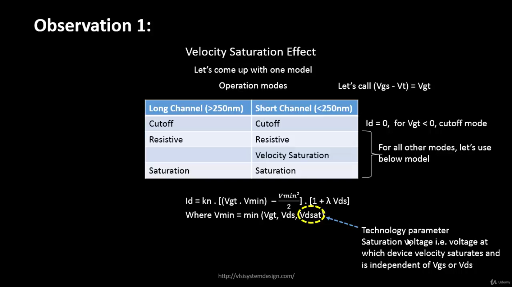

---

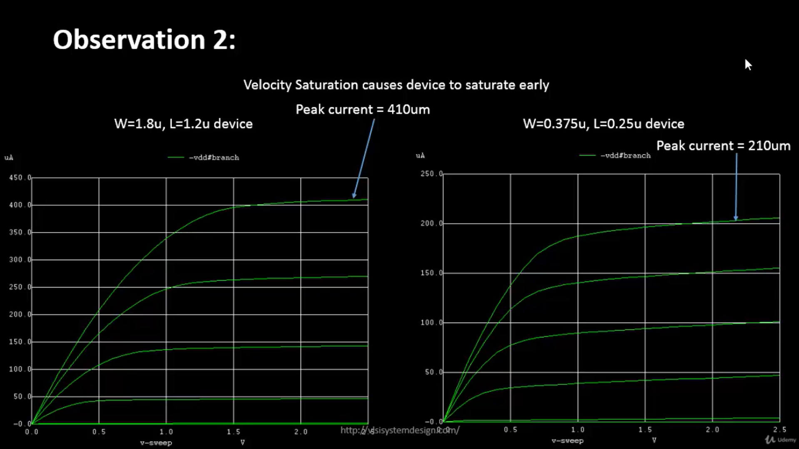

- From the above picture it is clear that, in the short channel the drain current has reduced and saturated earlier than long channel due to velocity saturation.


---

## 2. MOS Device Characteristics

- The **MOSFET acts as a switch**:  

| Condition | Device Behavior | Resistance |
|-----------|----------------|------------|
| VGS < VT  | OFF             | Infinite   |
| VGS > VT  | ON              | Finite    |

---

**Structure of CMOS**

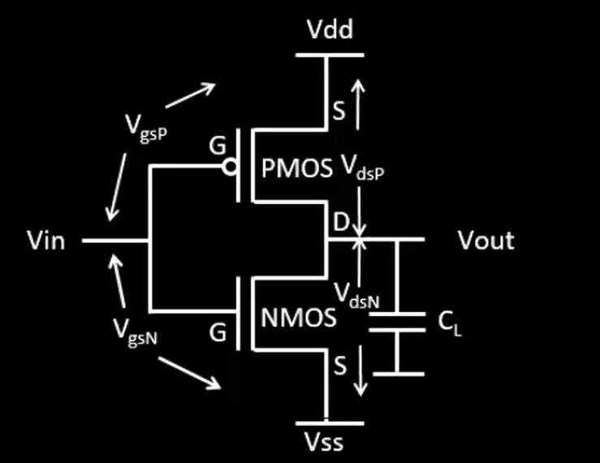

---

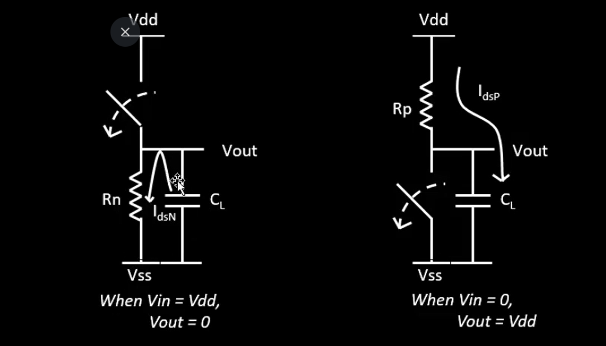

- Logic operation in **inverter configuration**:

| VIN | VOUT | Path Active |
|-----|------|-------------|
| 0   | VDD  | PMOS conducts |
| VDD | 0    | NMOS conducts |


- The direct paths between **VDD/VSS** and output during transitions lead to **short-circuit currents**.

---

### 2.1 Node and Device Voltages

We defined node voltages for analysis:
```bash
V_GSn = V_in - V_SS 
V_DSn = V_out 
V_GSp = V_in - V_DD 
V_DSp = V_out - V_DD
I_DSp = - I_DSn
```

---

## 3. NMOS and PMOS I–V Characteristics

- **NMOS:** I_dsn vs V_dsn curves observed for different VGS.  
- **PMOS:** I_dsp vs V_dsp curves, noting polarity differences.  

These curves help in understanding **pull-up and pull-down strengths** in a CMOS inverter.

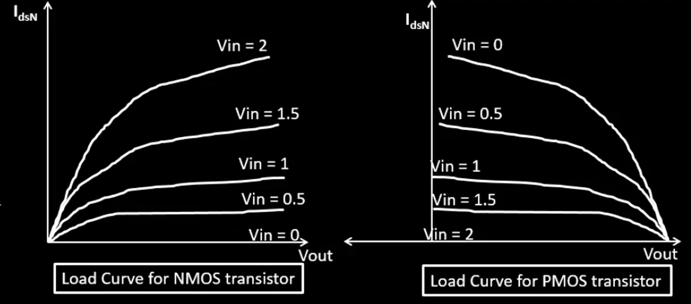

---

## 4. CMOS Inverter VTC

### 4.1 Steps Followed:

1. Identify **transistor regions** (linear/saturation) for both NMOS and PMOS.  
2. Equate **drain currents**: I_dsn = - I_dsp for static operation.  
3. Solve for **VOUT** as a function of **VIN**.  
4. Construct a **VTC table** with input vs output voltages.  

**Example Table:**

| VIN (V) | VOUT (V) | NMOS Region | PMOS Region |
|----------|----------|-------------|-------------|
| 0        | VDD      | OFF         | Linear     |
| 0.5      | 1.7      | Linear      | Saturation |
| 1.0      | 1.0      | Saturation  | Saturation |
| 1.5      | 0.3      | Saturation  | Linear     |
| 1.8      | 0        | Saturation  | OFF        |

---

### 4.2 Key Observations

- **Long-channel devices:** Quadratic ID–VGS leads to standard VTC shapes.  
- **Short-channel devices:** Velocity saturation reduces drive current at high VGS, slightly modifying the VTC slope.  
- NMOS and PMOS sizing (W/L ratio) affects **switching threshold (Vm)**.  

---

## 5. Insights and Discussion

- **Velocity saturation** is critical in short-channel devices; it **limits current**, affecting rise/fall times.  
- **CMOS inverter acts as a voltage-controlled switch**, with output determined by **relative strengths** of NMOS and PMOS.  
- Understanding **ID–VGS and ID–VDS characteristics** is essential for **accurate VTC and timing analysis**.  

---
## Day 3 - Lab

### Plot of I_D VS V_DS

**Spice Deck**
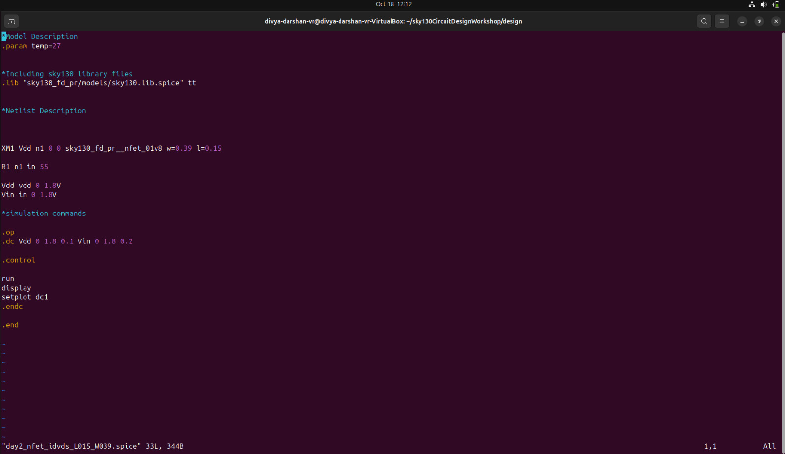

---
**DC Characteristics - I_D vs V_DS**
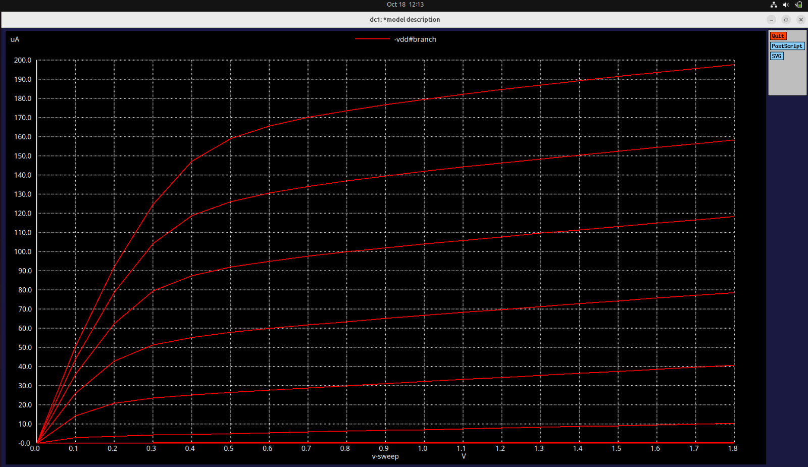

- From the plot , for the first two values of V_GS the current has quadratic dependence.
- Whereas, for above values of V_GS ,the current has linear dependance.

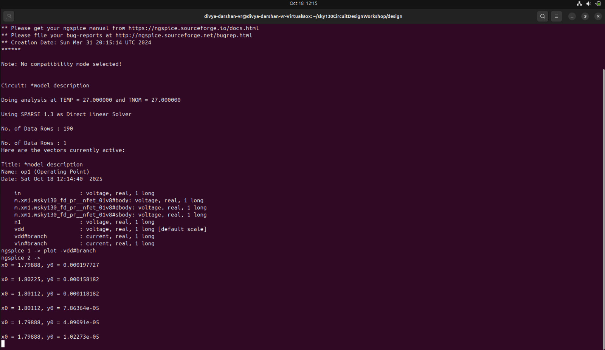

- From the above terminal output, the difference between 2 `I_D` for the respective V_GS value is approximately equals to `39 ~ 40 ua(micro amp)`.
---
### Plot of I_D VS V_GS

**Spice Deck**
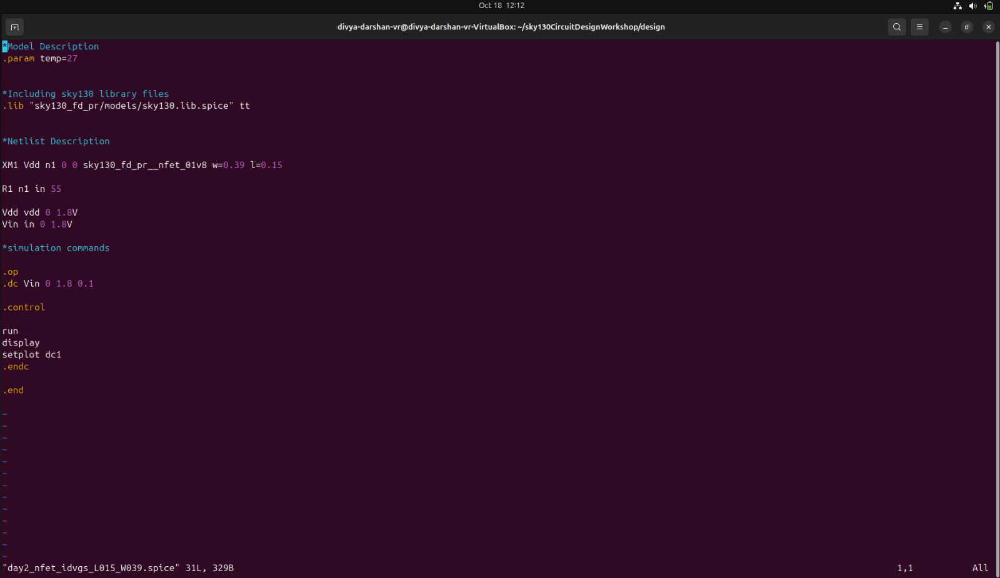

---
**DC Characteristics - I_D vs V_DS**
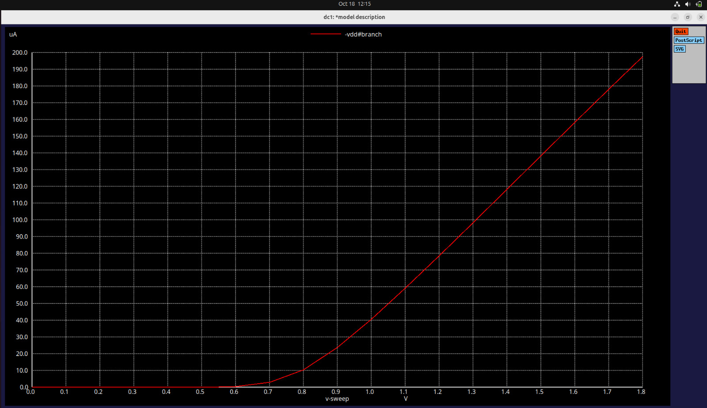

- By keeping `V_DS` as constant value of `2.5v` and varying the `V_DS` , we observed that the plot has quadratic dependance and later it becomes linear due to velocity saturation.


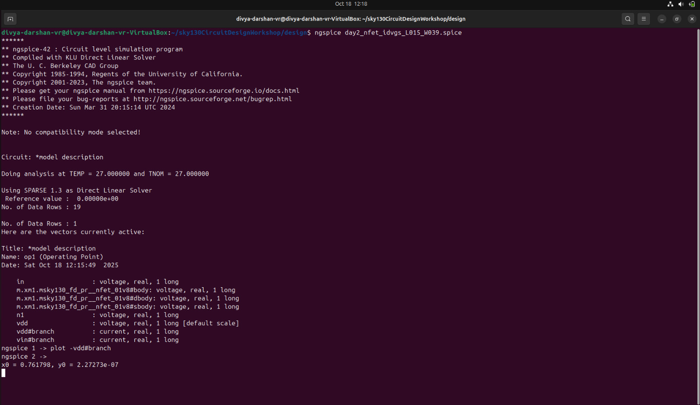

- From the above terminal output, the threshold voltage of the nmos is around `0.76v`.
- So if V_GS > 0.76v , then the device will turn on.
---
## Conclusion

- **Day 2** focused on the **basics of MOSFET behavior**, highlighting **long vs short channel effects**.  
- Velocity saturation was introduced to explain **linear ID–VGS behavior in short-channel MOSFETs**.  
- Derived the **VTC of a static CMOS inverter**, laying the groundwork for **switching threshold and noise margin analysis** in subsequent days.

---
