# Day 3: CMOS Switching Threshold and Dynamic Simulation
---

## Previous Day Summary
On **Day 2**, I studied the **basic CMOS inverter and its characteristics**, including:  
- Theory of **Voltage Transfer Characteristic (VTC) curve**  
- Behavior of **NMOS and PMOS transistors** in an inverter  
- Understanding the **switching threshold** from a theoretical perspective  

---

## Objective
The goal for **Day 3** was to simulate the **CMOS inverter VTC curve** using **SPICE** and perform **dynamic simulations** to extract:  
1. **Switching threshold** voltage  
2. **Rise time (t_r)** and **Fall time (t_f)**  

---

## 1. SPICE Simulation Setup

### 1.1 SPICE Netlist
A **SPICE deck** (netlist) contains:  
- **Component connectivity**  
- **Node identification and names**  
- **Transistor W/L ratios and supply voltage**

**Example Netlist Screenshot:**  
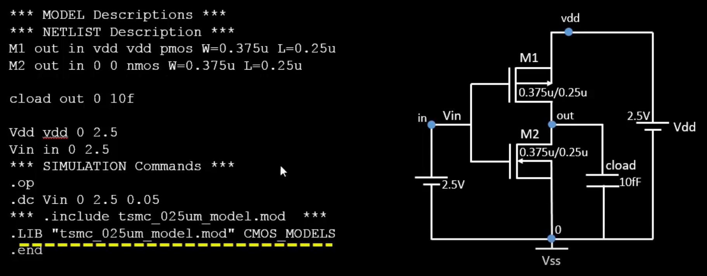

### 1.2 W/L Ratios for Simulation
Sir performed simulations for **two cases**:  

| Case | PMOS W/L | NMOS W/L |
|------|-----------|----------|
| 1    | 1.5       | 1.5      |
| 2    | 2.5       | 1.5      |

---

## 2. Voltage Transfer Characteristic (VTC) Simulation

### 2.1 Observations
- **Case 1 (PMOS = NMOS = 1.5)**:  
  - Switching threshold occurs **before 1.1 V**  
  - The VTC is slightly shifted due to equal W/L ratios  

- **Case 2 (PMOS = 2.5, NMOS = 1.5)**:  
  - Switching threshold occurs **between 1 V and 1.5 V**, matching **theoretical expectations**  
  - PMOS larger W/L ratio **compensates the drive strength of NMOS**, shifting threshold closer to theory  

### 2.2 VTC Graph
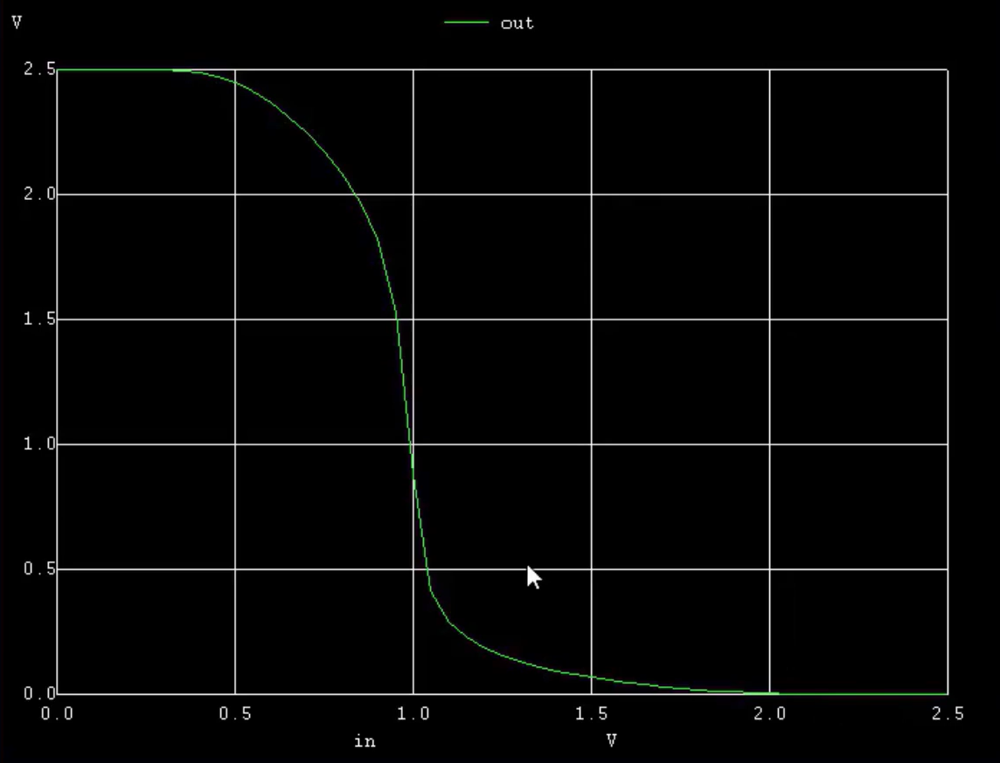 

- VTC graph for equal (W/L) ratio.
- Where the switching threshold is approximately equals to `0.99v`.

---
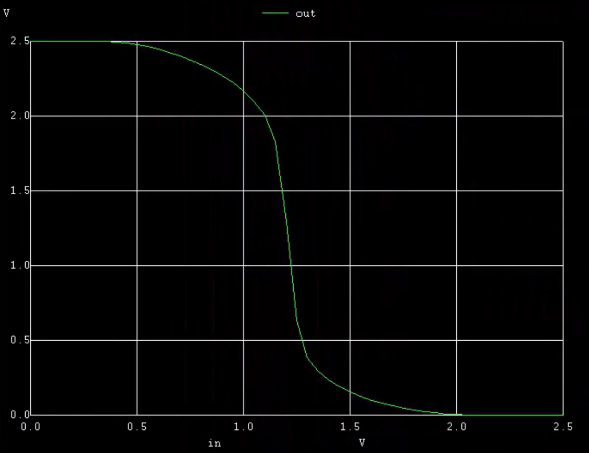 

- VTC graph for (W/L)p is twice the size of that of (W/L)n.
- Where the switching threshold is approximately equals to `1.2v`.

---

## 3. Transient Analysis (Dynamic Simulation)

### 3.1 Rise and Fall Delay
- **Rise time (t_r):** Time taken for output to rise from 50% of input voltage to 50% of output voltage  
- **Fall time (t_f):** Time taken for output to fall from 50% of input voltage to 50% of output voltage  

**Formula Used:**  
```Formula
t_r = 50% of Vout - %50 of Vin
t_f = 50% of Vout - %50 of Vin
```
---
## CMOS Switching Threshold – Detailed Analysis

- The switching threshold is the point where the input voltage (Vin) is exactly equal to the output voltage (Vout) in a CMOS inverter.
At this point, both PMOS and NMOS transistors are turned ON and operate in the saturation region.
- Because both transistors conduct simultaneously, a direct current path exists from VDD to GND, resulting in short-circuit (leakage) power.
- This is a key region in the inverter’s operation, as it influences the overall power consumption and switching characteristics.
---
## Switching Threshold Conditions

- At the switching point:
```bash
Vout = Vin
Vgs = Vds
I_dsp = - (I_dsp)
```
These relationships form the basis for deriving the switching threshold voltage (Vm) of the CMOS inverter.

---
## Switching Threshold Derivation

- I derived the expression for the switching threshold (Vm) by equating the drain currents of NMOS and PMOS when both are in saturation.

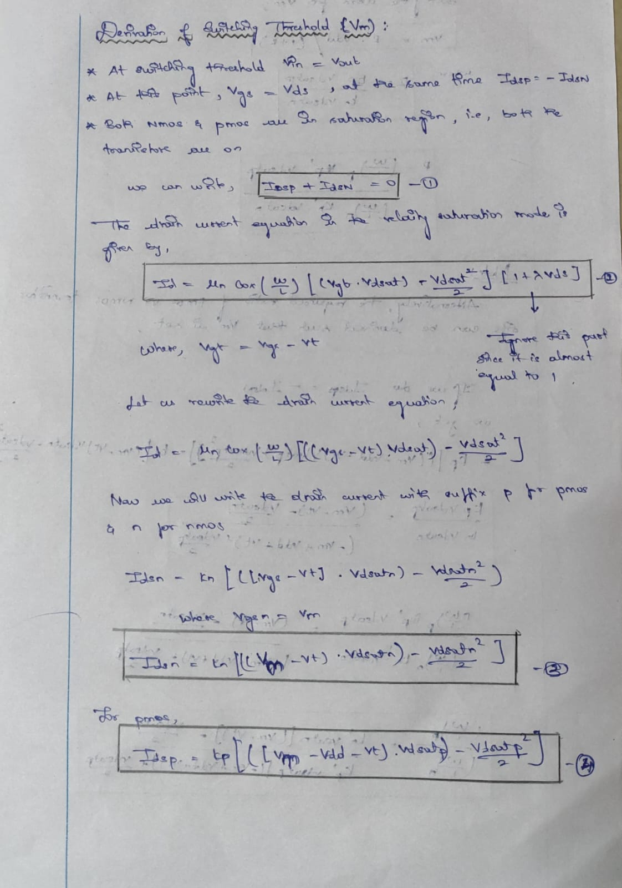

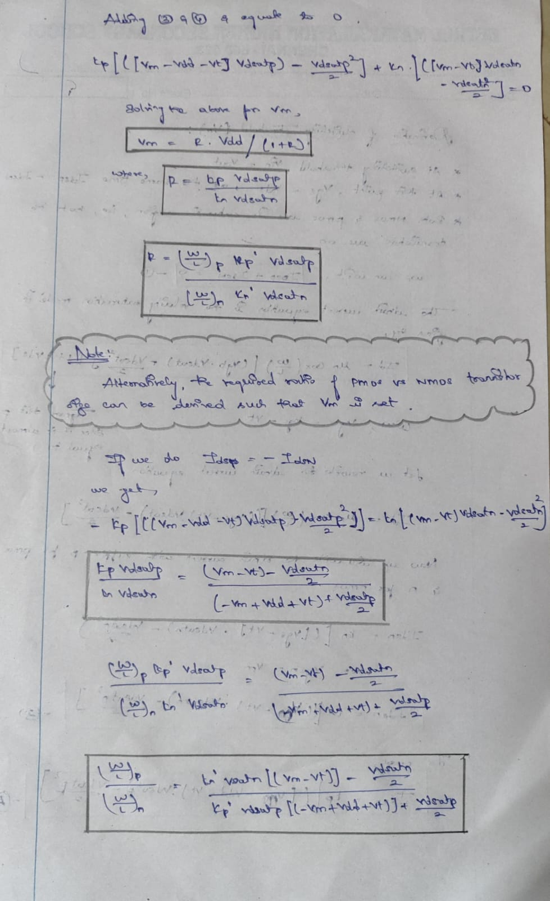

- We can also derive the (W/L) ratio while having the Vm.

---
## W/L Ratio Analysis

- We analyzed five different cases of PMOS and NMOS width-to-length ratios to study how sizing affects rise delay, fall delay, and switching threshold (Vm).

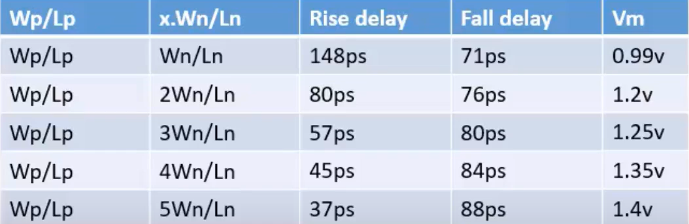

- These are the output observation from the simulation analysis.
---
## Observations and Discussion

- When (W/L)p ≈ 2 × (W/L)n, the PMOS becomes stronger, leading to balanced rise and fall delays.
This configuration provides equal transition times, which is ideal for clock inverters and buffer circuits.
- For larger ratios (3×, 4×, 5×), PMOS has higher strength, and these combinations are often used in timing data paths where faster rise delay is required.
- By tuning the W/L ratio, we effectively match the resistances of NMOS and PMOS, ensuring the expected delay and desired output response.

---
## Conclusion

- Across all five cases, the switching threshold (Vm) varied only about 50 mV, which is well within acceptable limits for fabrication tolerances.
- This shows the robustness of CMOS logic, as small fabrication variations do not significantly affect circuit performance.
- The 2× W/L ratio between PMOS and NMOS provides an optimal trade-off between speed, power, and symmetry.
- Larger PMOS sizes are typically chosen for timing-critical paths where the rise time needs to be minimized.
---

## Day 3 Lab

- The aim of the day 3 lab is to simulate and perform `VTC curve of CMOS` and `Transient anlaysis of CMOS`.
- The Results and reports are attached below.
---
## VTC Plot of CMOS 

### Spice deck 

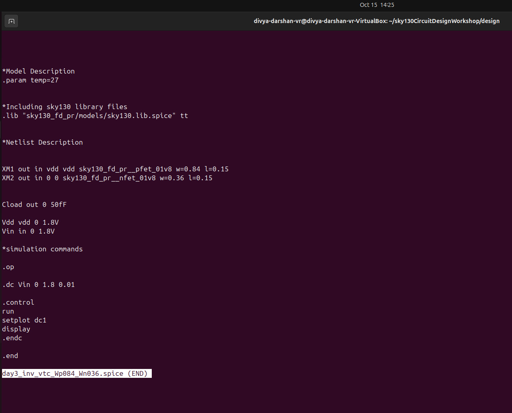

- From the netlist it is clearly visible that the (W/L) ratio of pmos is double the time than that of nmos.
- It has DC sweep of `0v` to `1.8v` in steps of `0.1v`.

---
## Terminal Screenshot of NgSpice

Command to do ngspice simulation
```bash
ngspice <filename.spice>
```

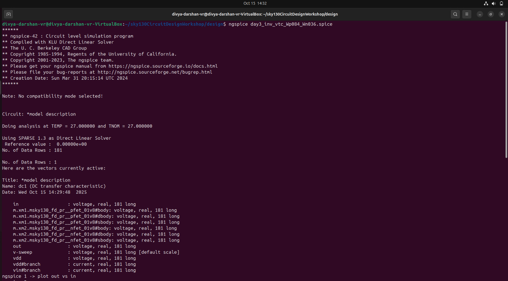

---
## VTC Curve

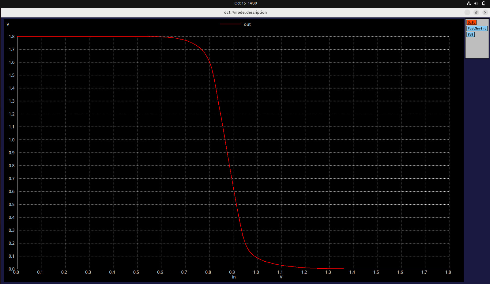

- From the plot , it is symmetrical.
- and has a switching threshold (Vm) of `0.87v` 
- Hence it is perfect for clock cells.


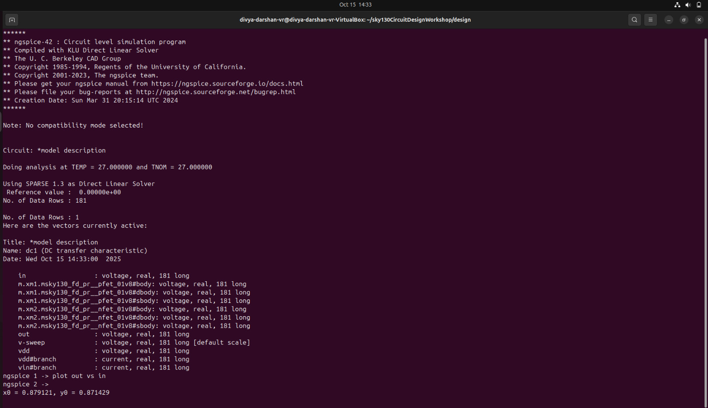

- So from the terminal output the switching threshold is approximately equals to `0.879v`

---
## Transient Analysis of CMOS

### Definition
Transient analysis is the study of a circuit's behavior during the temporary period when it changes from one steady state to another, typically after a sudden change like a switch closing or a voltage source turning on. 

---
## Spice Deck

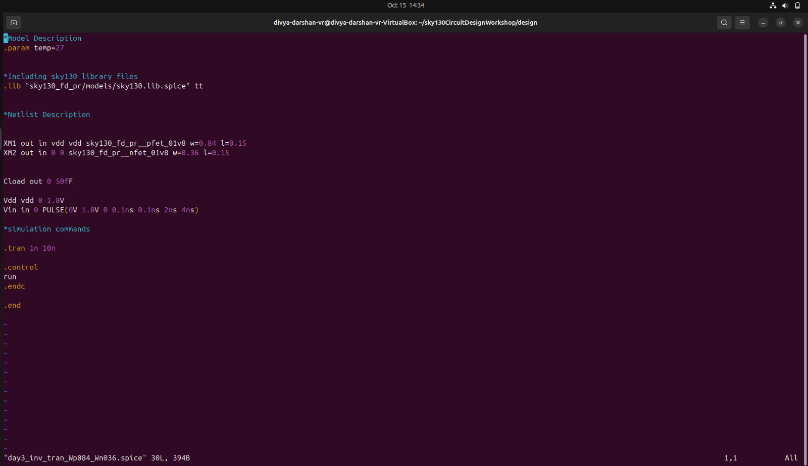

- From the netlist it is clearly visible that the (W/L) ratio of pmos is double the time than that of nmos.
- Here rather than DC sweep we are going to do transient analysis, hence the cmd `.tran 1n 10n` is used.
- Which means it will do transient analysis for the step size of `1ns` and for the duration of `10ns`.
---

## Terminal Screenshot of NgSpice

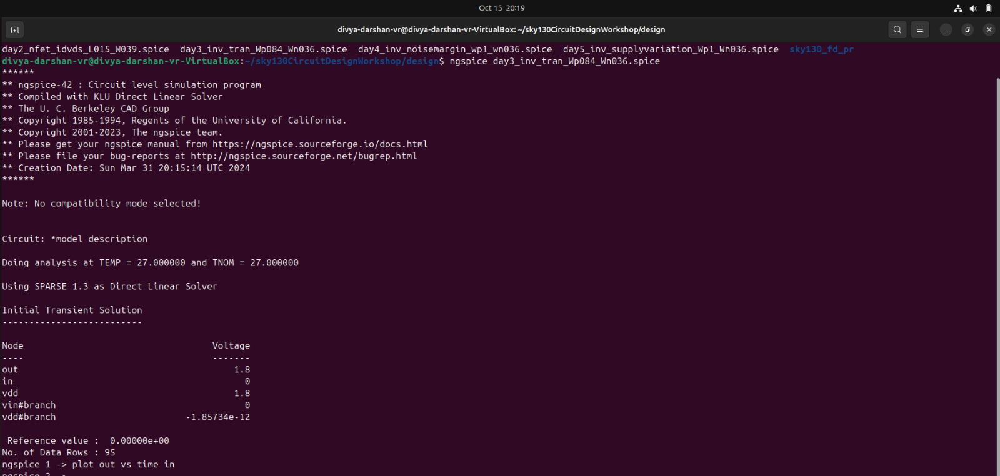

---
## Transient Output

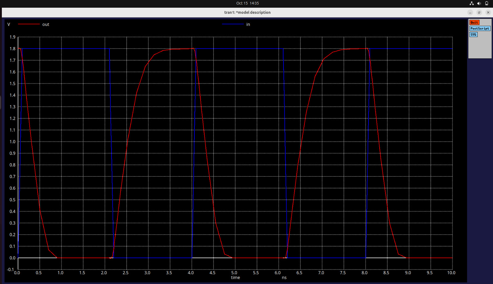

- From the plot , we are able to see the transient analysis of cmos.
- It is clear that when the input is `High to Low` the output is always `Low to High` i.e, the output is exactly complement to the input, which proves the inverter characteristics.
---
## Rise and Fall Delay

```bash
# Rise Delay

50% of Vout = 3.3536 ns
50% of Vin = 2.1643 ns

Rise delay (t_d) = 50% of Vout - 50% of Vin
                 = 3.3536 ns - 2.1643 ns

Rise delay (t_d) = 1.1893 ns
```

```bash
# Fall Delay

50% of Vout = 4.05488 ns
50% of Vin = 2.4878 ns

Rise delay (t_d) = 50% of Vout - 50% of Vin
                 = 4.05488 ns - 2.487 ns

Rise delay (t_d) = 1.56708 ns
```
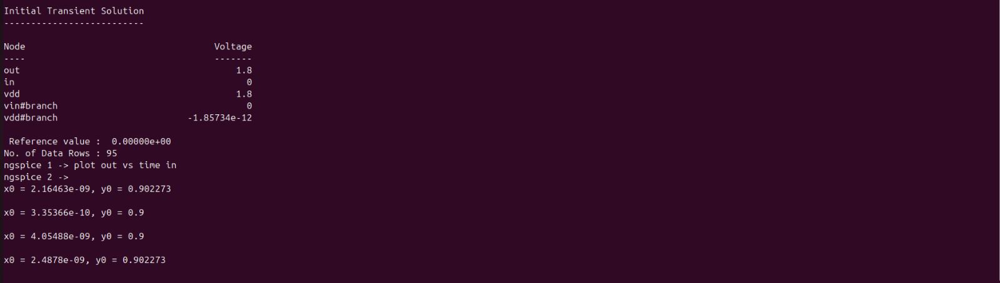

- From the rise and fall delay , it is clearly visible that the rise and fall delay are approximately equal, which is a typical characteristics of an clock inverter/buffer.  
---

## Connection to Device Physics

- During switching, both **NMOS and PMOS** momentarily conduct, forming a **direct current path** from VDD to GND.  
  This explains **short-circuit current** observed near Vm.  
- **Capacitive charging/discharging** of the output node defines the **rise and fall delays**, which depend on the **on-resistance** of each transistor and the **load capacitance**.  
- The **strong inversion region** for both devices corresponds to the steepest part of the VTC, directly impacting switching speed.  
- The balance in **carrier mobility (μn > μp)** is compensated by sizing the PMOS roughly twice the NMOS, ensuring equal drive currents.
---
## STA Correlation (Static Timing Analysis)

- In **STA**, the rise and fall delays extracted from this SPICE characterization translate into **cell delay tables** (.lib files).  
- The **switching threshold (Vm)** determines the **reference voltage level** (often 50% of VDD) used in timing analysis.  
- Variations in **device sizing, threshold voltage, or supply** directly shift these delay values, impacting setup/hold margins in STA.  
- This simulation thus forms the **foundation for delay modeling**, connecting transistor-level physics to gate-level timing libraries.
---
## Tabulated Summary

| **Category** | **Description / Observation** |
|---------------|-------------------------------|
| **Objective** | To perform SPICE simulation of CMOS inverter to analyze VTC, switching threshold, rise and fall delays |
| **Simulation Tool** | NgSpice using Sky130 PDK |
| **Supply Voltage (VDD)** | 1.8 V |
| **DC Sweep Range** | 0 V → 1.8 V (step = 0.1 V) |
| **Simulation Types** | DC Analysis (VTC), Transient Analysis |
| **W/L Ratios Tested** | (1.5/1.5), (2.5/1.5), and extended cases up to (5×) |
| **Switching Threshold (Vm)** | ≈ 0.87 V – 1.2 V (depending on W/L ratio) |
| **Best Balanced Ratio** | (W/L)p = 2 × (W/L)n |
| **Transient Analysis Command** | `.tran 1n 10n` → Simulate 10 ns with 1 ns step |
| **Rise Delay (tᵣ)** | 1.1893 ns |
| **Fall Delay (t_f)** | 1.5670 ns |
| **Observation on Waveform** | Output inverts input; symmetrical transfer curve at balanced W/L ratio |
| **Key Insight** | Increasing PMOS size improves rise delay and balances switching threshold |
| **Conclusion** | CMOS inverter shows robust performance; (W/L)p ≈ 2 × (W/L)n gives optimal speed–power symmetry |

---
## Conclusion

- On **Day 3**, a comprehensive SPICE-based study of the **CMOS inverter** was carried out to determine its **switching threshold (Vm)** and **dynamic performance (rise and fall delays)**.  

- The experiments included both **DC (VTC)** and **Transient simulations** for different **PMOS and NMOS W/L ratios** using the **Sky130 technology**.  

- Key insights revealed that the **switching threshold** closely aligns with theoretical predictions when the **PMOS is twice as wide** as the NMOS, achieving a balanced rise and fall response.  

- The **transient analysis** confirmed the inverter’s functionality, where output transitions complement input transitions, and the **delay metrics** were accurately measured from 50% voltage crossings.

---
