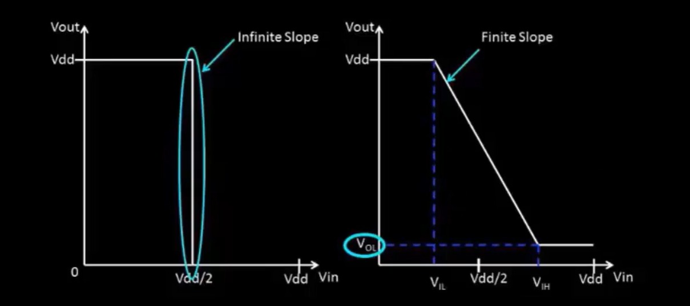
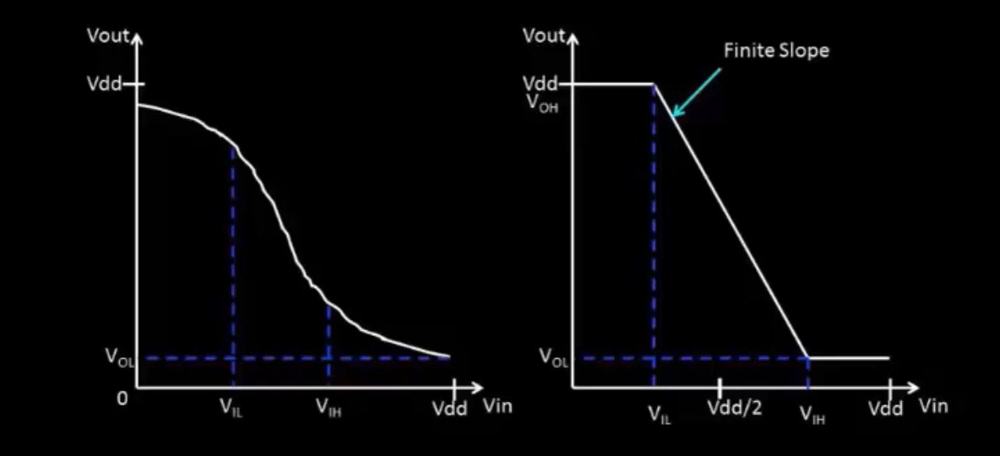
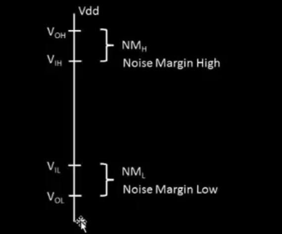
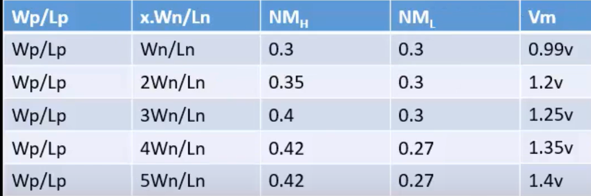
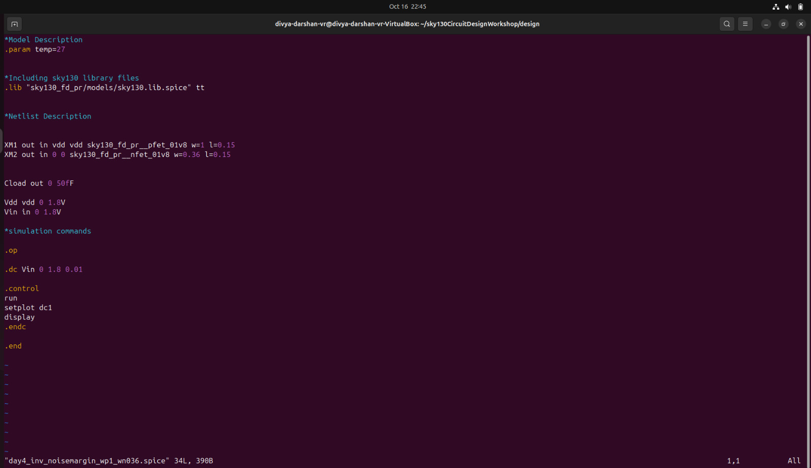
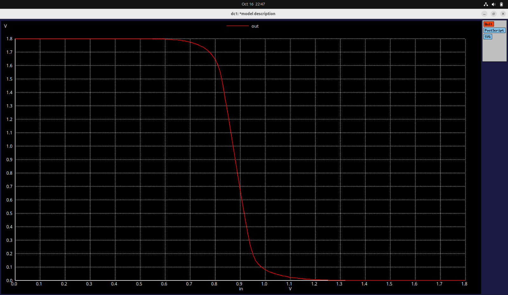
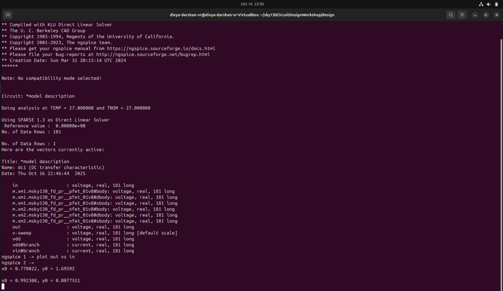

# Day 4: CMOS Noise Margin and Robustness Evaluation
---

## Objective
The goal for **Day 4** was to understand and analyze the **Noise Margin** of a CMOS inverter and evaluate its robustness in the presence of noise. This topic builds upon the previous day’s discussion on CMOS inverter characteristics and voltage transfer behavior.

---

## Topics Covered

### 1. **Definition of Noise Margin**
Noise margin represents the **tolerance of a logic circuit against unwanted noise or disturbances**.  
It defines the maximum noise voltage that can be superimposed on a logic level without causing an error in the logic interpretation at the next stage.

---

### 2. **I–O Characteristics of CMOS Inverter**

We began by analyzing the **input–output (I–O) characteristics** of a CMOS inverter:



- **Ideal Inverter:**  
  - Represented by a **perfect rectangular** transfer characteristic.  
  - Exhibits an **infinite slope** at the transition region, meaning the switching occurs instantly between logic 0 and logic 1.

- **Acutual Inverter:**  
  - Exhibits a **slanted or gradual transition** between logic levels.  
  - The slope is **finite**, resulting in a more realistic voltage transfer curve.  




- **Practical Inverter:**  
  - Exhibits a **curvier or gradual transition** between logic levels.  
  - The slope is `-1`, resulting in a more realistic voltage transfer curve.  

---

### 3. **Key Voltage Parameters**

In the second plot, we labeled important voltage levels that define the noise margins:

| Symbol | Description | Function |
|:-------:|:-------------|:----------|
| **V_IL** | Input Low Voltage | Max input voltage recognized as logic ‘0’ |
| **V_IH** | Input High Voltage | Min input voltage recognized as logic ‘1’ |
| **V_OL** | Output Low Voltage | Output voltage corresponding to logic ‘0’ |
| **V_OH** | Output High Voltage | Output voltage corresponding to logic ‘1’ |

---

### 4. **Logic Level Relationships**

From the inverter’s I–O curve, the following relationships were analyzed:

- If `Vin` lies between **0 < Vin < V_IL** , then `Vout = HIGH`. 
- If `Vin` lies between **VIH < Vin < VDD**, then `Vout = LOW`.

To ensure proper logic recognition at the next stage:
- **V_OL < v_IL** (so logic `0` is correctly detected)
- **V_OH > v_Ih**  (so logic `1` is correctly detected)

---

### 5. **Noise Margins**

The **noise margins** define how much noise the circuit can tolerate without error:

- **Noise Margin High (NM_H):**

```bash
NM_H = V_OH - V_IH
```
- The maximum noise voltage a logic HIGH can withstand and still be recognized as HIGH.

- **Noise Margin Low (NM_L):**
 ```bash
  NM_L = V_IL - V_OL
  ```
- The maximum noise voltage a logic LOW can tolerate and still be recognized as LOW.



---

### 6. **Undefined Region**

- Between **V_IL** and **V_IH**, the logic level is **undefined**.  
- Any voltage in this region may be interpreted unpredictably as either logic 0 or logic 1, depending on device and environmental variations.

---
### 7. **Noise Margin Level for Different values of (W/L) ratio**



- As `PMOS` size increases the strength of `PMOS` increases while the strength pf `NMOS` decreases.
- This leads to `low` Noise margin Low (NM_L) and `High` Noise Margin High (NM_H).
---

## Day 4 Lab - Noise Margin/Robustness Analysis

### Spice Deck


---
### Noise Margin Characteristics



- In this graph we need to find the point where the slope is `-1` inorder to find the noise levels.



- From the terminal output, it is clear that the values of noise level voltages are,
```bash
v_IL = 0.778022 V
V_OH = 1.695920 V
V_IH = 0.992308 v
V_OL = 0.087755 V
```
- Therefore, from the noise level voltages the noise margin high and low can be calculated.

```bash
NM_H = V_OH - V_IH
     = 1.695920 - 0.992308

NM_H = 0.703612 v

------
NM_L = V_IL - V_OL
     = 0.778022 - 0.087755

NM_L = 0.69026 V
```
 - So from the value it is inferred that if the output lies in the range of `NM_H` then it can be completely recognize as logic `1`.
 - If the output is lies in the range of `NM_L` then it can be recognized as logic `0`.
---
## Device Physics Correlation
- Noise margin depends on transistor sizing (W/L) and drive strength.
- Balanced PMOS/NMOS sizing ensures symmetrical noise margins.
- Short-circuit currents near switching threshold affect NM_H / NM_L slightly.
- Robust design ensures the next logic stage correctly interprets voltage levels, preventing errors in digital circuits.
---
## Conclusion
In this session, we:
- Defined **noise margin** and its role in ensuring logic robustness.  
- Analyzed **I–O characteristics** of CMOS inverters from ideal to practical.  
- Identified critical voltages (**V_IL**, **V_IH**, **V_OL**, **V_OH**) and their relationships.  
- Derived and understood **Noise Margin High (NMH)** and **Noise Margin Low (NML)**.  
- Understood how proper voltage level spacing enhances **CMOS circuit robustness** against noise.

---

