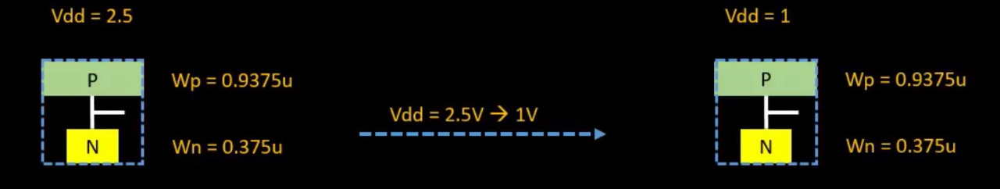
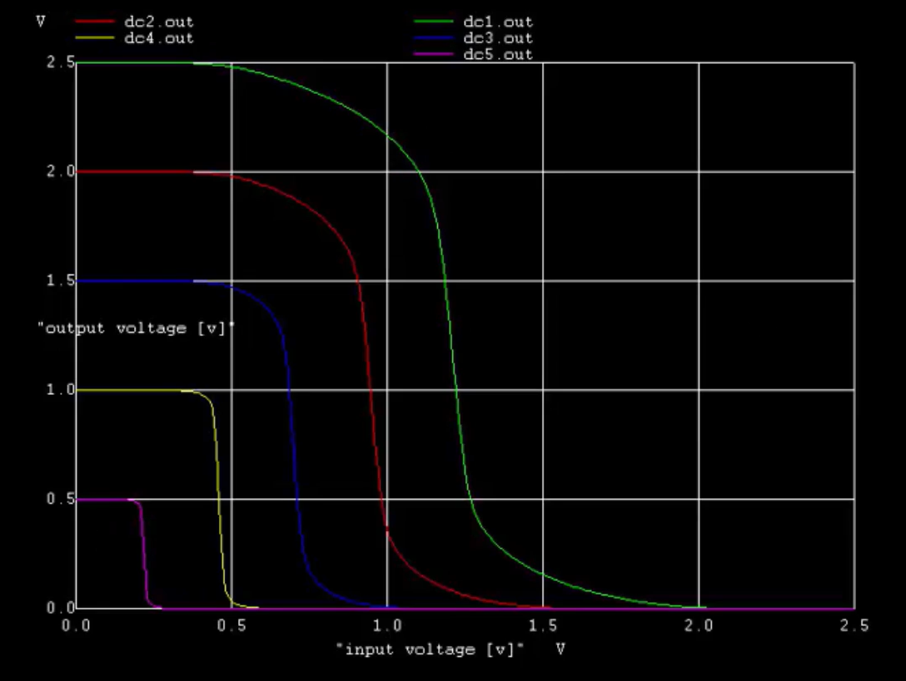
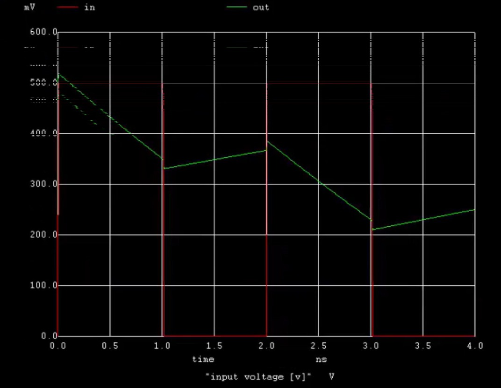
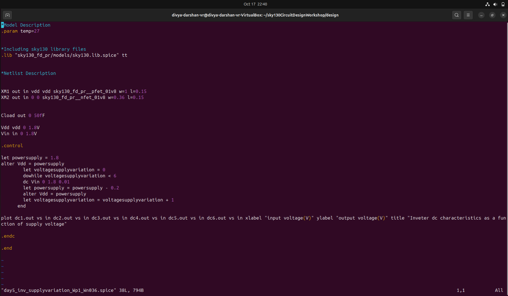
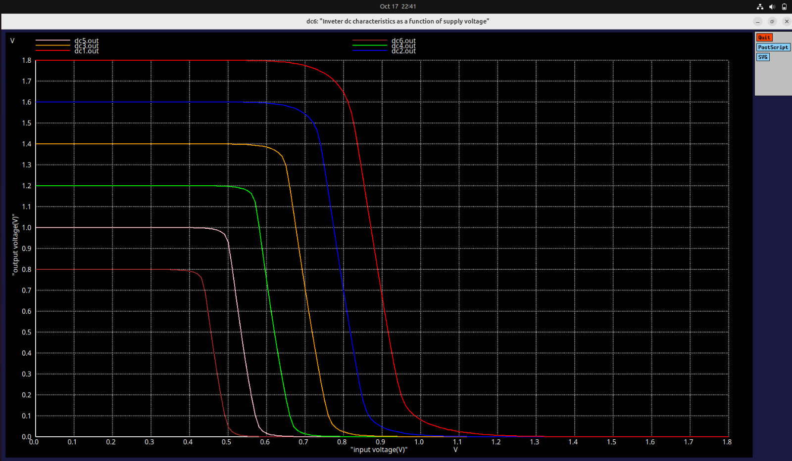
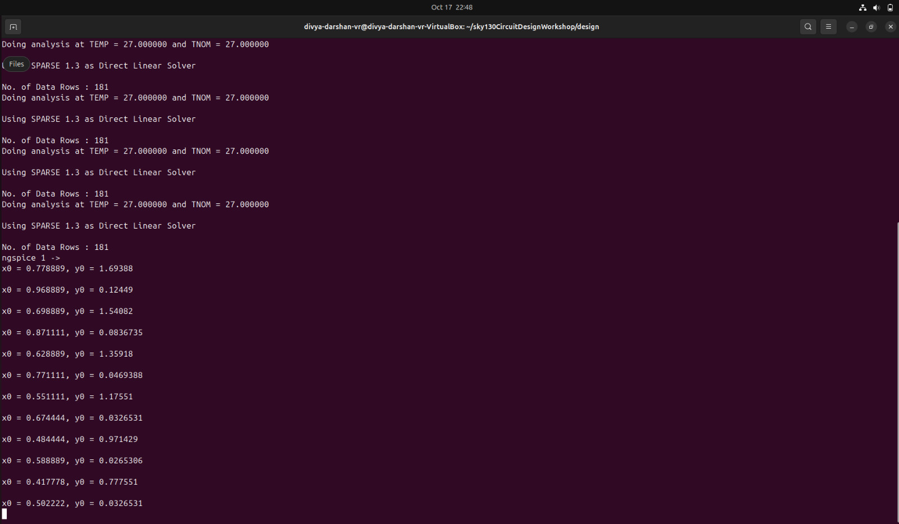
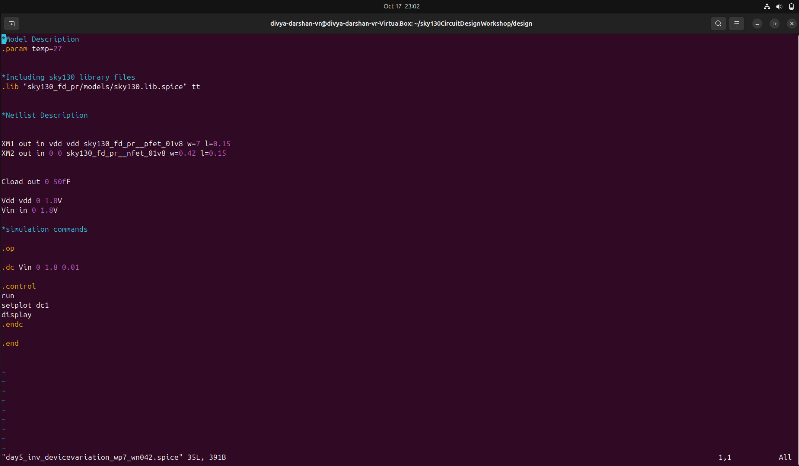
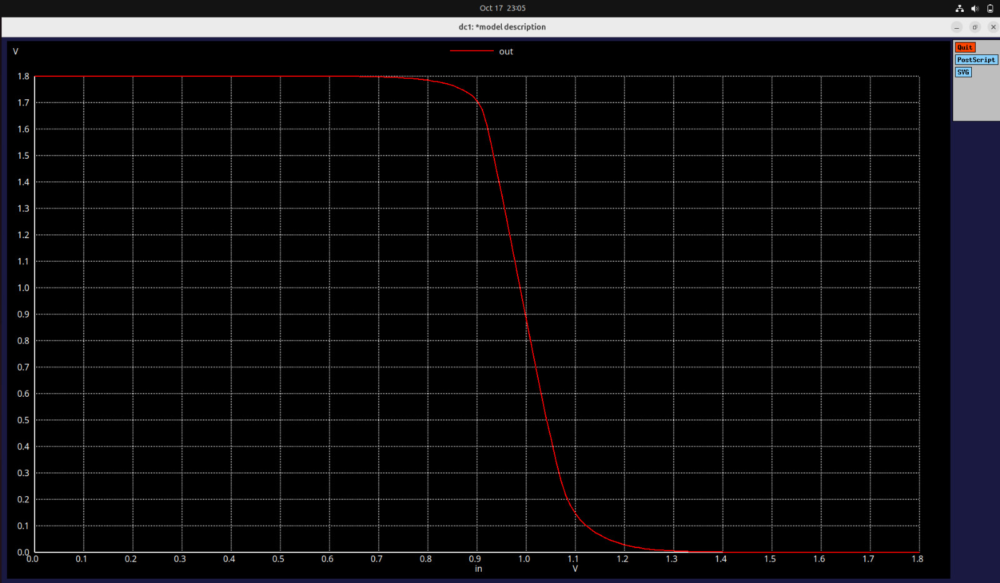
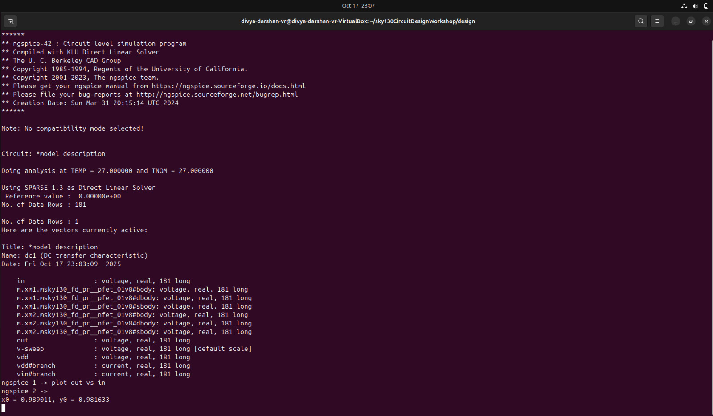

# Day 5 - CMOS Power Supply and Device Variation Robustness Evaluation

---

##  Objective
To study how CMOS circuits behave under **power supply variations** and understand the **impact of voltage scaling** on gain, delay, and energy efficiency. Additionally, to evaluate the **device variation robustness** using SPICE simulation.

---

## **Topics Covered**

### 1. Introduction to Power Supply Variation
- The concept of **power supply variation** in CMOS circuits was introduced.  
- The input voltage was varied from **2.5 V down to 0.5 V** to observe how CMOS behavior changes.  
- Even when the supply voltage decreases, CMOS can still function — but its **performance and speed** vary significantly.  



- Here the picture demonstrates starting from `strong pmos and weak nmos` to all the way down to `strong nmos and weak pmos`.
---

### 2. SPICE Simulation for Power Supply Variation
- We analyzed a **SPICE netlist** that demonstrates power supply variation between **2.5 V and 0.5 V**.  
- Inside the SPICE file, between the statements:
```bash
.control
...
.endc
```
we can perform **high-level scripting operations** such as loops, sweeps, or even TCL-like commands to automate simulations.

---
### 3. VTC Curve Analysis



- From the above screenshot, it is clear that the cmos operating in `2.5v` has a configuration of `Strong pmos and weak nmos` and conversely the cmos in `0.5v` has a configuration of `weak pmos and strong nmos`.
---

### 4. Discussion: Why Not Always Use Low Supply Voltages (e.g., 0.5 V)?
- A key question arose — if CMOS can still operate at 0.5 V, why don’t we use such low voltages everywhere?  
- To understand this, we compared the **gain**, **energy**, and **delay** characteristics at different supply voltages. 

---

## Gain Comparison

| Supply Voltage (VDD) | Gain | Improvement (%) |
|----------------------:|------|----------------:|
| 2.5 V | 7.38 | — |
| 0.5 V | 11.83 | **≈ 56%** |

**Observation:**  
At lower supply voltages (0.5 V), the gain improved by around **56%**, which is highly beneficial for **analog design** applications where amplification is important.

---

## Energy Comparison

The switching energy of a CMOS circuit is proportional to **½ C V²**.  

| Supply Voltage (VDD) | Energy Expression | Relative Energy |
|----------------------:|------------------:|----------------:|
| 2.5 V | ½ C (2.5)² | 100% |
| 0.5 V | ½ C (0.5)² | **≈ 4% (≈ 96% reduction)** |

**Observation:**  
Using 0.5 V leads to a **96% reduction in energy consumption**, which is ideal for **low-power designs**.

---

##  Delay and Performance Comparison

| Parameter | 2.5 V | 0.5 V | Observation |
|:-----------|:------|:------|:-------------|
| Rise Delay | 66 ps | Not sufficient to charge transistor | Slow transition |
| Fall Delay | 78 ps | Much longer | Reduced performance |

**Observation:**  
- At lower voltages, the **transistor cannot charge/discharge fully**, leading to a **significant increase in delay**.  
- This results in **poor performance** even though energy consumption is lower.  
- Hence, **practical CMOS circuits** (like those in mobile chips) typically use **1–1.5 V** instead of extremely low voltages.



---

## Advantages and Disadvantages Summary

| Advantages (Low VDD) | Disadvantages (Low VDD) |
|-----------------------|-------------------------|
| ~56% improvement in gain | Increased rise/fall delay |
| ~96% reduction in power consumption | Poor switching performance |
| Suitable for analog designs | Not practical for high-speed logic |
| Better energy efficiency | Device may fail to fully switch ON |

---

## Day 5 - Lab 1
- Conducted a **SPICE-based power supply variation experiment**.  
- Simulated and observed **gain** for various supply voltages starting from **1.8 V down to 0.8 V**, reducing by **0.2 V steps**.  
- Analyzed the **device variation robustness** and **performance parameters** for each voltage level.

**Simulation Screenshot:** 


- Here the pmos is thrice the times greater than nmos.
- we are plotting the cmos `vtc` curve, starting from `1.8v` and reducing in steps of `0.2v` till `0.8v`.
- So totally six curves will come.

---

**Output VTC Curve**


- As we inferred in netlist , the output matches as we expected.



- From the above values, let us calculate the gain values

```bash
1. For 1.8 V - |Gain| = 8.259
2. For 1.6 V - |Gain| = 8.460
3. For 1.4 V - |Gain| = 9.226
4. For 1.2 V - |Gain| = 9.266
5. For 1.0 V - |Gain| = 9.049
6. For 0.8 V - |Gain| = 8.810
```
- From the observation the gain has started to increase has voltage decreases but after 1v there is a reduction in gain of the cmos.
---
## Day 5 - Lab 2
- In this lab we have done spice simulation on device variation.

### Spice Netlist



- Here the size of nmos is very very larger than pmos `[(W/L)P >> (W/L)N]`. 
---
### VTC Characteristics



- Eventhough there is a huge size variation in the cmos device, the vtc characteristics is still maintained.

### Switching Threshold



- From the above screenshot we could see the switching threshold to be `0.98v` approx.
- From the inference , we can conclude that even there is a huge difference in size of transistors, the cmos is working perfectly and vey minimal dfference in switching threshold.
- This proves the `CMOS` is `ROBUST`to any variation.
---
## **Key Takeaways**
- CMOS circuits are **robust to power supply variations**, but **performance vs. energy trade-offs** must be carefully balanced.  
- **Low-voltage operation** enhances gain and reduces power, but introduces **severe delay and reliability issues**.  
- Understanding **supply variation behavior** is crucial for **designing reliable, low-power CMOS circuits** in modern VLSI systems.

---

